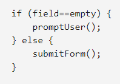

# Control flow
** Control flow ** is the order in which a computer uses statements in a script.
The code is run sequentially from the first line in the file to the last line, without the computer running structures that changes the control flow, such as conditionals and loops.

For example, consider the script used to verify user data from a web page form. The script transmits verified data, but when the user, say, leaves the required field blank, the script encourages them to complete it.To do this, the script uses a conditional structure or if...else, so that different code executes depending on whether the form is complete or not:

For example, the example above can be within the active function when the user clicks the Submit form button. The function can also include a loop, which runs through all the fields in the form, checking each one in turn. Looking back at the code in the if and else sections, the lines prompt user and submit form could also be calls to other functions in the script. As you can see, control panels can control the complex flow of processing even if there are only a few lines of code.&#9989