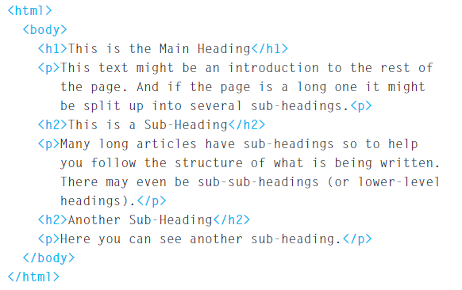

# intro to web development 

### what is HTML?
HTML is a Hypertext Markup Language and a computer language that makes many web pages and applications made online. Hypertext is text used to identify other pieces of text, and markup language is a series of tags that tell web servers the style and structure of text.

Here are some of the most common uses for HTML:

- **Web development**: Developers use HTML code to design how a browser renders web page elements, such as text, links and media files.

- **Internet navigation**: Users can easily navigate and insert links between related pages and websites as HTML is widely used to embed links.

- **Web documents**: HTML makes it possible to edit and format documents, similar to Microsoft Word.

people usually access the web using:

1- **Browsers**: People access websites using software called a web browser. Popular examples include Firefox, Internet Explorer, Safari, Chrome, and Opera.

2- **Web servers**: Web servers are special computers that are constantly connected to the Internet, and are optimized to send web pages out to people who request them.

3- **Screen readers**: Screen readers are programs that read the user's computer screen content. They are often used by people with visual impairments.

You can see the HTML code of this page below. Don't worry about what the code means right now. We start looking at it in more detail on the next page. Note that the HTML code is blue, and the text you see on the screen is black.

HTML code (blue) is made up of characters that live within angled brackets - these are called HTML elements. Items are usually made up of two tags: an opening tag and a closing tag. (The closing tag has an extra slash on the front of it.) Each HTML object tells the browser something with information that stays between the opening and closing tags.

## body, Head and titLe

**Body**: Everything inside this element is shown inside the main browser window.

**head**: This contains information about the page (rather than information that is shown within the main part of the browser window that is highlighted in blue on the opposite page).

**title**: The contents of the title element are either shown in the top of the browser, above where you usually type in the URL of the page you want to visit, or on the tab for that page

## Looking at How otHer Sites are built
When the web was first taking off, one of the most common ways to learn about HTML and discover new tips and techniques was to look at the source code that made up web pages.

Once you have opened this page, you can look for the view menu in your browser, and select the option that says source or view source.

# the evolution of HTML
Each new version is designed for final upgrades (with new features and attributes and the old code has been removed) There are also several versions of each browser used to view web pages, each using a new code. However, not all web users have the latest browsers installed on their computers, which means that not everyone will be able to view all the latest features and features.

**HTML 4**: HTML 4 released ***1997*** extends HTML through processes of style sheets, writing, frames, inserts, advanced left-to-left text and integrated text support, rich tables, and form enhancements, providing advanced access for people with disabilities.

HTML 4.01 is an HTML 4.0 update that fixes errors and makes some changes from previous revisions.

XHTML: XHTML released in ***2000*** is a family of current and future document types and modules that reproduce, set and expand HTML 4 [HTML4]. XHTML family scripts are designed for XML, and ultimately designed to work in partnership with XML-based user agents.

HTML5: HTML5 released in ***2000*** is the latest version of Hypertext Markup Language, a code that describes web pages. There are actually three types of code: HTML, which gives structure; Cascading Style Sheets (CSS), overseeing the launch; and JavaScript, which makes things happen.

## HTML5 is introducing a new set of elements that help define the structure of a page.

They are covered here (rather than the other HTML elements you encountered at the beginning of the book) because you will find it easier to understand how to use them now that you have seen how CSS can control page layout. These innovations will play an important role in building structures going forward. In this chapter you will see:

- New HTML5 layout elements and their use

- How they contribute in other useful ways to the object div

- How can you make sure that older browsers see these things?

## This section discusses a process that you can use when you are creating a new website.

Looks like who can visit your site and how you can make sure the pages include the information visitors need. It also incorporates some important design elements to help you build professional looking sites. In this chapter, we will consider:

- How to understand the audience your site might be attracted to and what information they would expect to find on it
- How to organize information so that visitors can get what they want
- Creative design to present information in a way that helps visitors achieve their goals
- Design tips to help you create more attractive and efficient sites

## How to find out who your website is made for

While many websites list their creators, designers and direct owners, some contain anonymous writing or have authors written in fake names. This makes it difficult to accurately quote a Web page, to find out if the author has knowledge of a nearby topic or to contact a designer to build a site for you. Even if you don't find this information on the page itself, it may be hidden in the site code or found in an online database.

## reasons why people want to work with you

You can be a gaming website where people come to play games, you can sell products or you can offer a free eBook to retrieve data. Website visits can come to your website from people who are ready to make money or information. When these visitors stay on your site, you should make sure they do what they want right away. There are no barriers, no complicated way to get a transaction point.

You will hear PPC experts talk about the importance of landing pages, the best calls to action in click-through payment ads compared to the landing page. When you watch TV shopping channels and want to buy something on screen, the caller already knows what they want to buy, they don't care to tell you who they are, what year they started the company and how they do it provide a good service.

# **JavaScript**
## **how javascript makes web pages more interactive**
1- **access content** You can use JavaScript to select any element, attribute, or text from an HTML page.

2- **modifys content** You can use javaScript to add elements, attributes, and text to the page, or remove them. 

3- **program rules** You can specify a set of steps for the browser to follow (like a recipe), which allows it to access or change the content of a page

## examples of javascript in the browser 

***Access*** the content of the page 

***Modify*** the content of the page 

***Program*** rules or instructions the browser can follow

***React*** to events triggered by the user or browser 

............................................................................................................................................................

# **The ABC of programming**
first of all you need to become familiar with some key concepts in computer programming. They will be covered in t hree sections: 

**A.** what is code and how do i write one?

**B.** how does computer work with the world around them?

**C.** how do i write a script for a web page?

............................................................................................................................................................

### **What is a script?**

A script is  a series of instructions that a computer can follow to achieve a goal. 

for writing a script you need a goal first in order to reach you goal.

People can achieve complex goals without thinking too much about them, for example you can drive a car, cook breakfast, or send an email without a detailed set of instructions. But the first time we do these things may seem daunting. So, when we learn a new skill, we tend to break it down into smaller tasks, and we learn to do one at a time. From experience each of these tasks grows familiar and seems simple.

### Start with the big picture of what you want to achieve, and break that down into smaller steps. 
 1- mark your goal 
 
 2- design and create a script 

 3- code each part

Computers are very intelligent and obedient. They need to be told all the details of what they are expected to do, and they will do so without question. Because they need different types of damage compared to you or me, everyone who learns to plan makes a lot of mistakes in the beginning. Do not be discouraged.